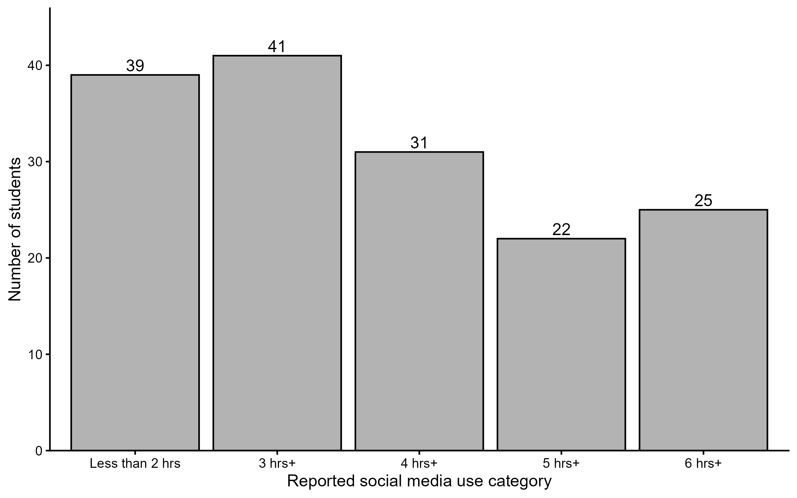
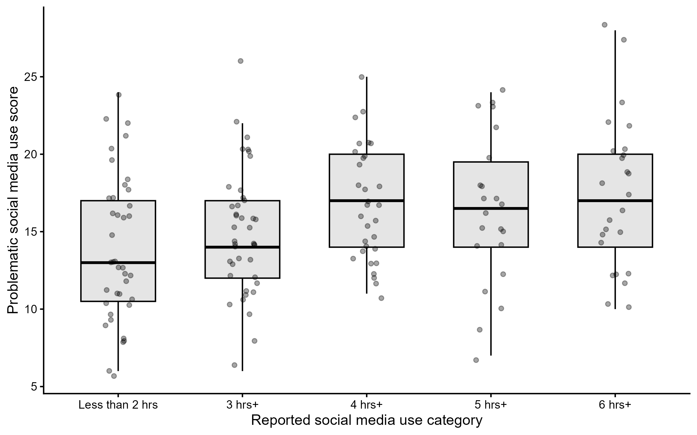
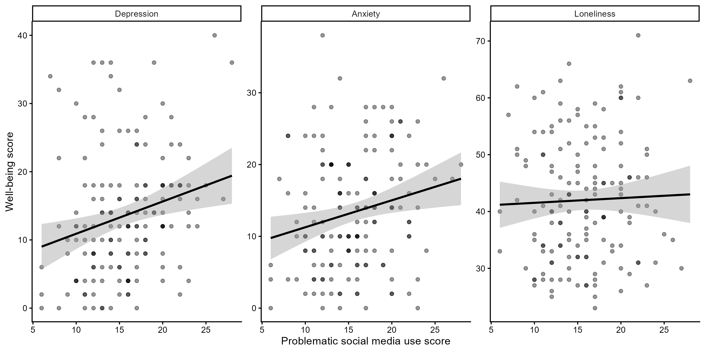
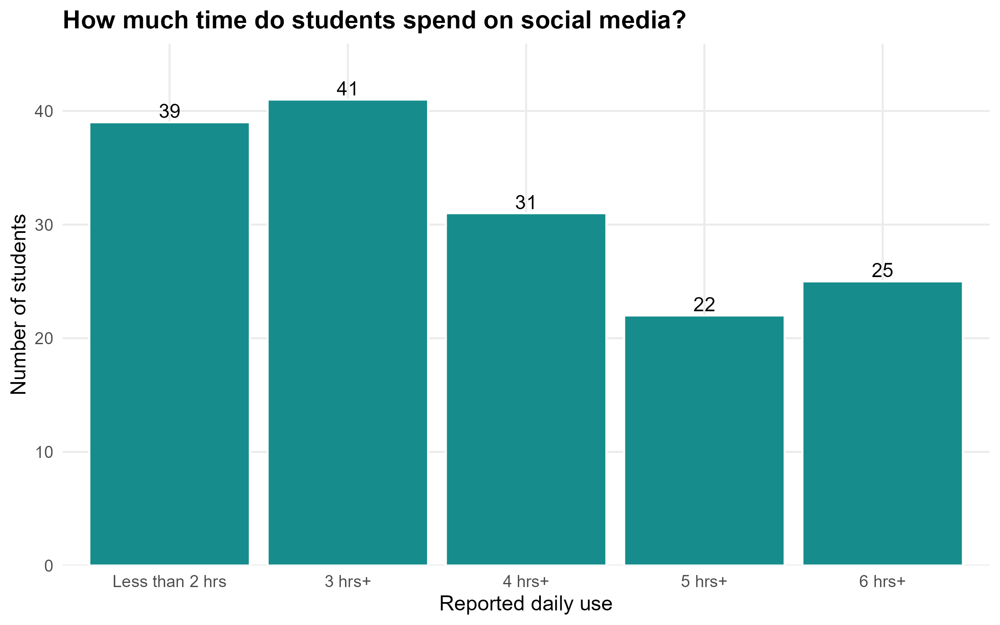
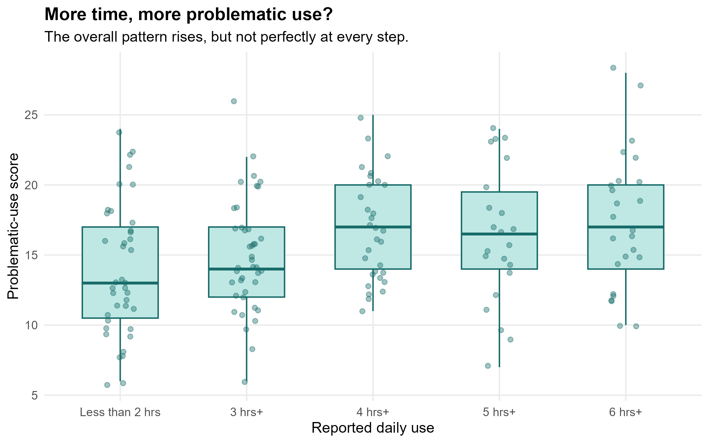
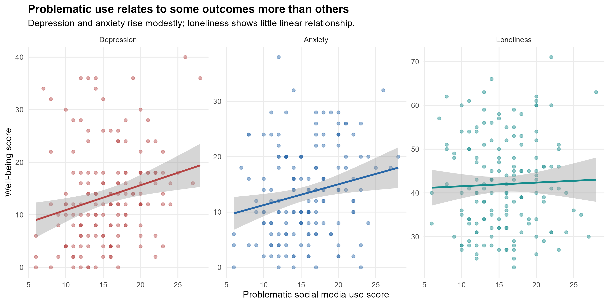

# Social Media Use and Student Well-Being

**An accessible data story exploring social media use, problematic social media use, and well-being among first-year university students.**

## Project Overview

How is social media use related to student well-being?

This project explores data from 158 first-year university students to examine reported social media use frequency, problematic social media use, and three aspects of well-being: depression, anxiety, and loneliness.

The findings suggest that the relationship between social media use and well-being is more nuanced than the idea that spending more time on social media is always worse. Problematic social media use was modestly associated with depression and anxiety, while no statistically significant linear association was found with loneliness.

These are observational findings and do not establish cause-and-effect relationships.

## Key Findings

* **Frequency and problematic use:** Problematic-use scores differed across the five reported frequency groups (Kruskal–Wallis test: χ²(4) = 11.97, *p* = .018).
* **Depression:** A modest positive association was found between problematic-use and depression scores (*r* = .233, *p* = .003).
* **Anxiety:** A modest positive association was found between problematic-use and anxiety scores (*r* = .208, *p* = .009).
* **Loneliness:** No statistically significant linear association was found (*r* = .035, *p* = .671).

## Visualizations

### 1. Social Media Use Frequency

### 2. Problematic Social Media Use: Scientific Visualization

### 3. Well-Being Outcomes: Scientific Visualization

### 4. Accessible Social Media Use Frequency

### 5. Accessible Problematic Social Media Use

### 6. Accessible Well-Being Visualization

## Data Source

University of Liverpool, *Social Media use on 1st-year Students' Experiences and Well-being*.

[View the dataset on Zenodo](https://doi.org/10.5281/zenodo.13759037)

* **Sample size:** 158 first-year university students.
* **Variables:** Reported social media use frequency, problematic social media use, depression, anxiety, and loneliness.

## Methods

* Descriptive statistics to summarize reported social media use.
* Kruskal–Wallis test to examine differences in problematic-use scores across five frequency groups.
* Pearson correlations to examine linear associations between problematic-use scores and well-being measures.
* Data visualization using R, ggplot2, and Quarto.

## Limitations

The data are observational and self-reported. The findings do not establish causal relationships and may not generalize to all university students. Four observations were missing from the loneliness analysis, which included 154 students; depression and anxiety analyses included 158 students.

The reported frequency categories were treated as ordered groups rather than exact, equally spaced measures of time.

## Technologies

* R
* Quarto
* ggplot2
* haven
* Git and GitHub
* HTML

## Author

**Marjan Nikbakhtzadeh**
